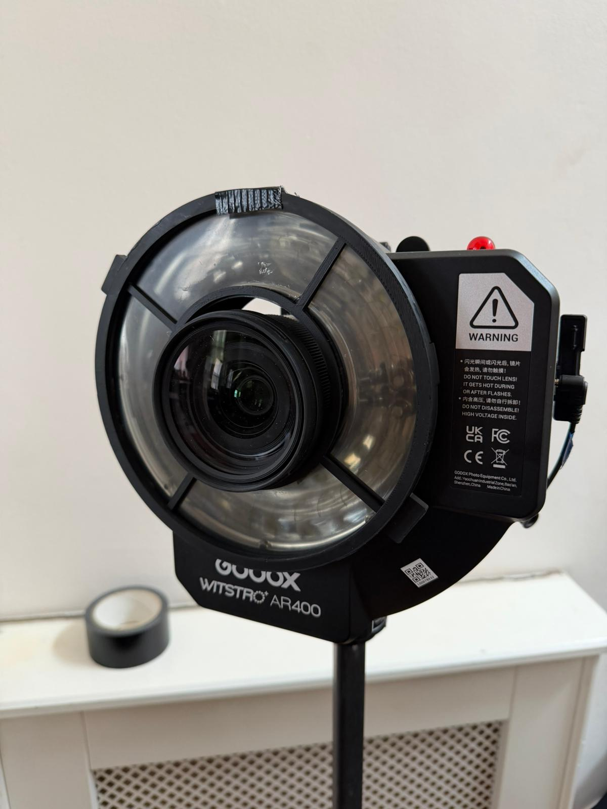

# Godox AR400 Cross-Polarizer Mount (Version 3)

A clean, standalone repository for a 3D-printed polarizer holder for the **Godox AR400** ring flash.

Use this with:
- A linear polarizing film/filter on the AR400 holder
- A circular polarizer on your camera lens

When the flash polarization and lens polarization are crossed (90 degrees), surface reflections are heavily reduced, which is useful for photogrammetry capture.

## Assembly Video

Direct video link: [assembly.mp4](media/assembly.mp4)

If your GitHub client supports inline HTML video, this player also works:

<video src="media/assembly.mp4" controls muted playsinline width="900"></video>

## What Is Included

- `blender/Godox_Flash_Polarizer.blend`: Editable source model
- `prints/version3/*.stl`: Printable meshes
- `prints/version3/*.3mf`: Slicer-ready project files
- `prints/version3/printer-gcode/*.gcode`: Example Prusa MK3S gcode from source
- `media/assembly.mp4`: Combined short assembly clip
- `docs/assembly-preview.gif`: Embedded motion preview for README

## Parts (Version 3)

- `Godox_Flash_Polarizer_Tube`
- `Godox_Flash_Polarizer_Outer_Loop`
- `Godox_Flash_Polarizer_Outer_Loop.001`
- `Godox_Flash_Polarizer_Center_Support.001`

## Quick Print Notes

- Source gcode indicates a **0.15 mm layer height** on Prusa MK3S.
- Print in black PLA/PETG if possible to reduce stray light.
- If fit is tight/loose on your AR400, tune XY compensation or scale minimally in slicer.

## Usage (Photogrammetry)

1. Mount the printed holder on the AR400.
2. Install polarizing film/filter in the holder.
3. Install CPL on the lens.
4. Rotate CPL until specular highlights are minimized.
5. Keep camera and flash settings fixed during a capture set.

## Suggested Camera Setup Baseline

- Manual exposure
- Fixed white balance
- Constant aperture and ISO
- Disable auto lighting optimizations

## On-Camera Reference Photo

Mounted setup image is shown in the Assembly section above.
